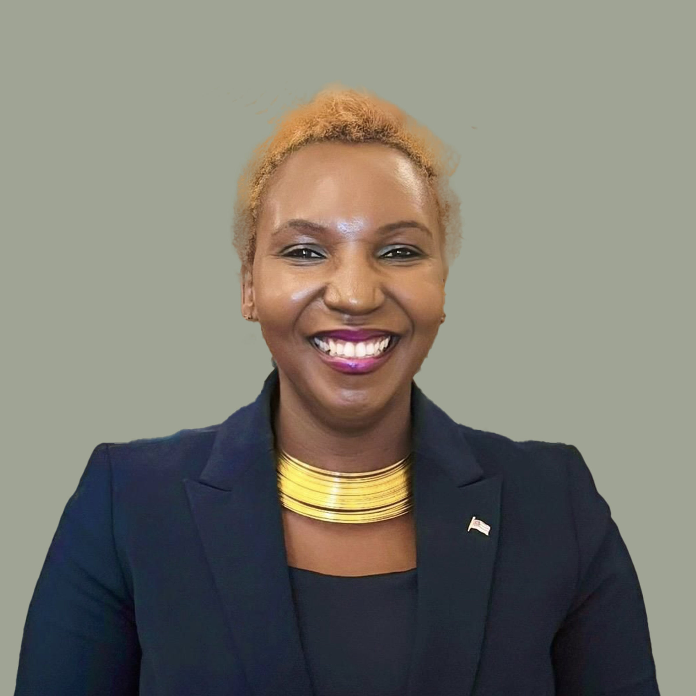
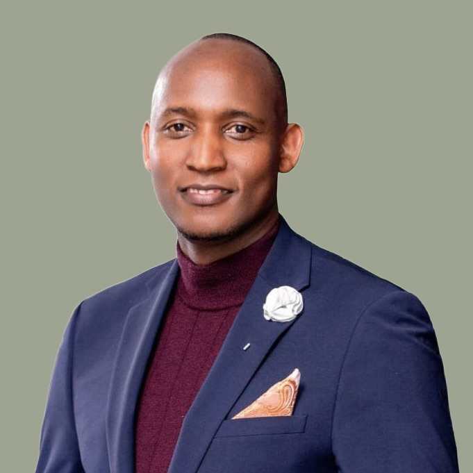
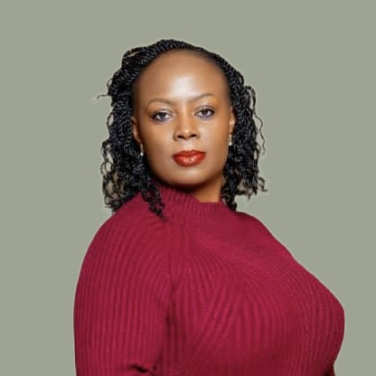
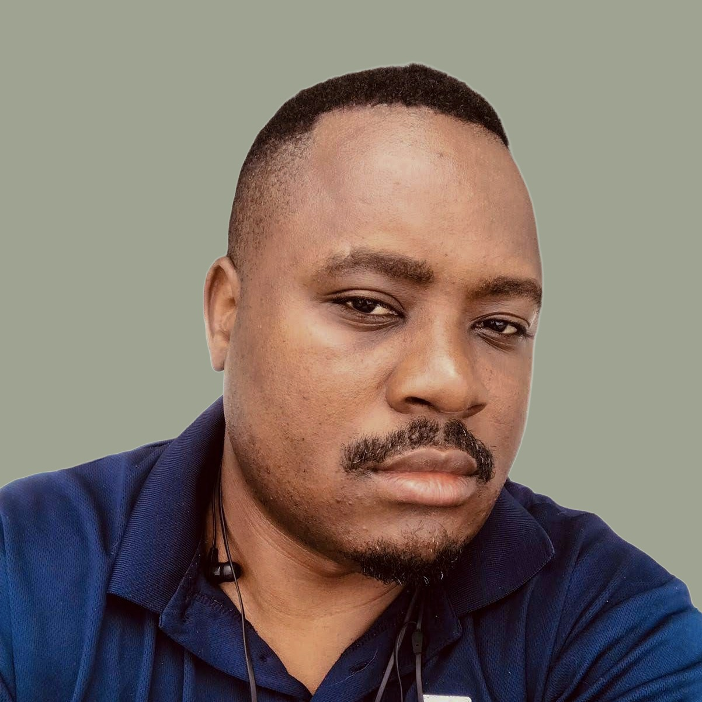
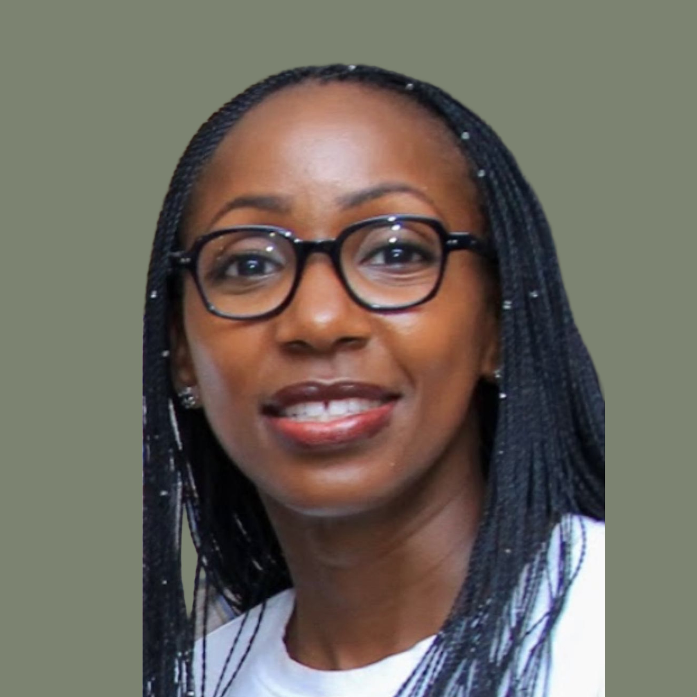
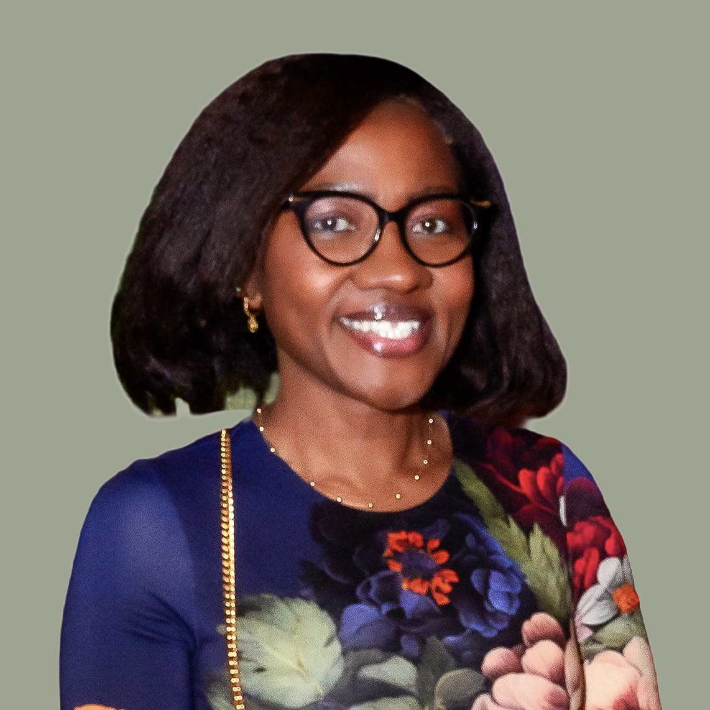
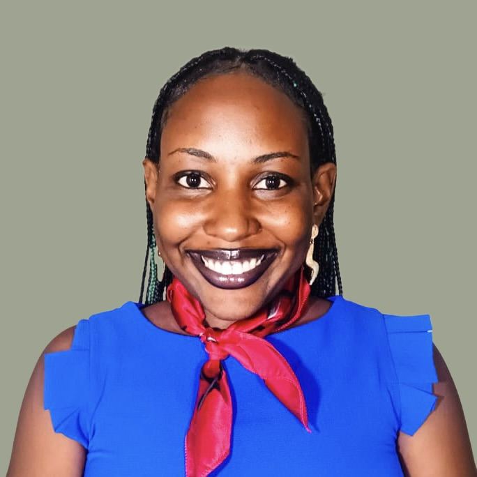
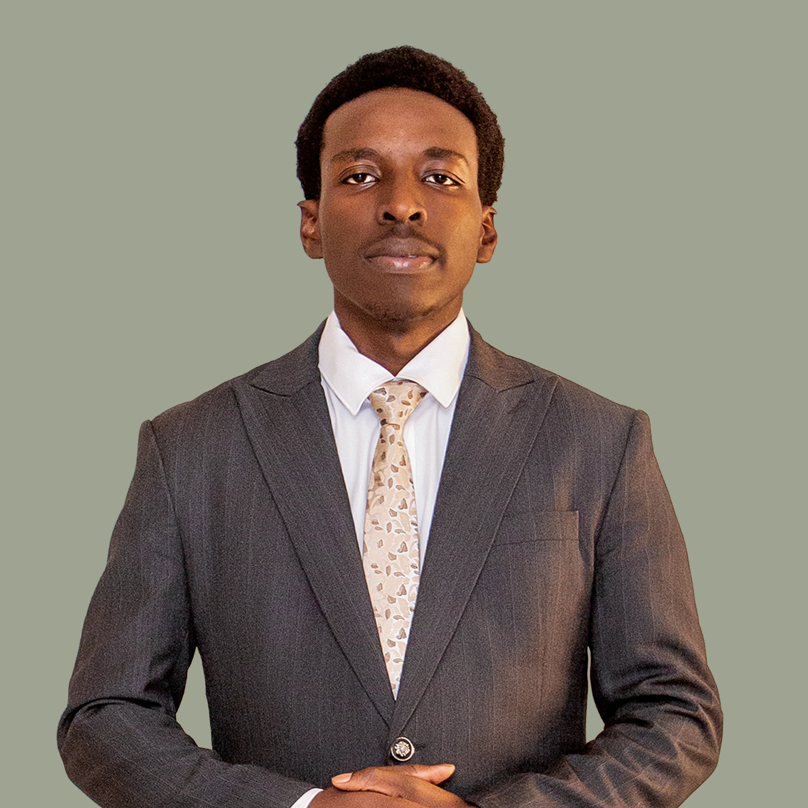
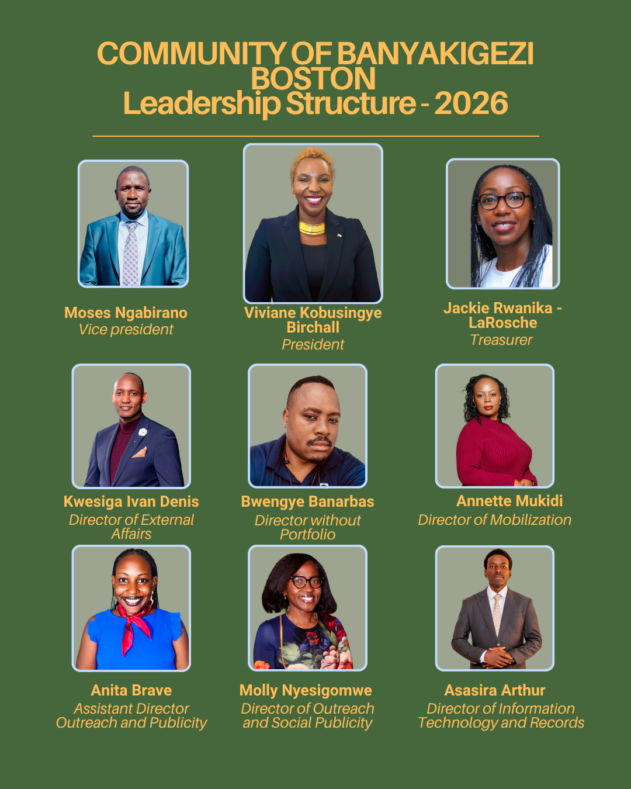

# Community of Banyakigezi — Boston

## Leadership Structure — 2026

### Executive

- **Viviane Kobusingye Birchall** — President
  
- **Moses Ngabirano** — Vice President
  
- **Jackie Rwanika-LaRoche** — Treasurer
  

### Directors

- **Kwesiga Ivan Denis** — Director of External Affairs
  
- **Bwengye Banarbas** — Director without Portfolio
  
- **Annette Mukidi** — Director of Mobilization
  
- **Molly Nyesigomwe** — Director of Outreach and Social Publicity
  
- **Anita Brave** — Assistant Director of Outreach and Publicity
  
- **Asasira Arthur** — Director of Information Technology and Records
  

---

